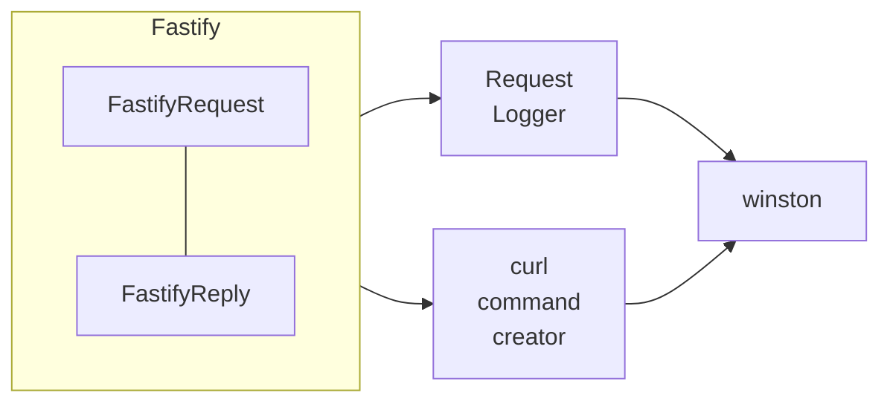

# logging controller


[](https://npmcharts.com/compare/@maeum/logging-controller)
[](https://github.com/maeumjs/logging-controller)
[](https://github.com/maeumjs/logging-controller/issues)
[](https://www.npmjs.com/package/@maeum/logging-controller)
[](https://github.com/maeumjs/logging-controller/actions/workflows/ci.yml)
[](https://github.com/maeumjs/logging-controller/blob/master/LICENSE)
[](https://codecov.io/gh/imjuni/logging-controller)
[](https://github.com/prettier/prettier)

The `@maeum/logging-controller` is an implementation of best practices for handling logging in the fastify.js framework. It allows you to pick and choose which logging framework you want to use between winston and pino, and provides standard guidelines when you don't know what to log. It also provides methods for logging richer logs. For example, it takes extra work to include the payload from a FastifyReply to a client in the log, but in `@maeum/logging-controller` all I need to do is tell it I want to log it. Use `@maeum/logging-controller` to log richer, easier logs!

Why use `@maeum/logging-controller`?

- You can choose your favorite package between [winston](https://github.com/winstonjs/winston/) and [pino](https://github.com/pinojs/pino)
- Convert `FastifyRequest` to [curl](https://curl.se/) so you can quickly reproduce problems when they occur
- You can logging the payload of a reply object
- When logging the payload of a reply object, you can compress it with [snappy](https://github.com/google/snappy)

## Getting Started

### installation

```bash
npm install @maeum/logging-controller --save
```

## Configuration

```ts
import { pino as pinoBootstrap, RequestLogger } from '@maeum/logging-controller';

// bootstrap pino logger
pinoBootstrap(false);

const server = fastify()

// pino logger add in fastify by plugin
server.register(RequestLogger.it.plugin, RequestLogger.it);
```

## How to work?

The `@maeum/logging-controller` consists of various functions, including functions to initialize winston and pino, functions to extract information for logging from FastifyRequest, and functions to generate curl commands. These functions make it easy for developers to log detailed information while also allowing them to customize the information needed for logging.


